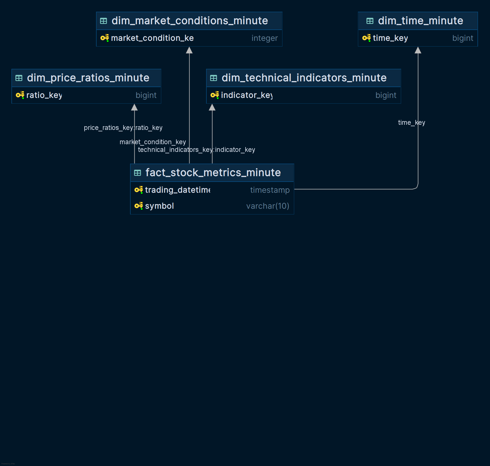

# Market Event Predictor

This project develops a Market Event Predictor System for NASDAQ-100 stocks that intelligently identifies and predicts short-term market anomalies including crashes, dips, rallies, and volatility spikes. Using minute-by-minute OHLCV data, the system classifies events based on percentage price movements within 30-minute windows, ranging from normal fluctuations (±1%) to significant crashes or rallies (±3%). The solution employs supervised classification models, time series analysis, and anomaly detection techniques to create an early warning tool for traders and analysts. The system serves as both a risk management tool and opportunity detector, with potential applications for retail trading platforms, hedge funds, and fintech startups seeking to integrate predictive market indicators. The project follows an iterative development approach, starting with model training on historical data and progressing toward real-time prediction capabilities with alert systems.

## Requirements

- `Python (>= 3.11 - < 3.12)`
- `Poetry (>= 2.1.3)`

## Installation

1. Clone the repository:

   ```bash
   git clone https://github.com/BredaUniversityADSAI/2024-25-y1d-teamwork-group-13
   cd Deliverables/project
   ```

2. Create virtual environment and install required packages:

    ```bash
    poetry install
    ```

3. Run the app:

    ```bash
    poetry run python src/project/app/app.py
    ```

### Files needed to run the app

The app does not generate data or models at startup. Before running it, make
sure these files exist:

- `src/project/app/BKNG_engineering.csv` - historical data for the chart.
- `src/project/app/BKNG_engineering_test.csv` - test data for the simulation.
- `src/project/models/saved_models/stage1_lstm.keras`
- `src/project/models/saved_models/stage2_lstm.keras`
- `src/project/models/saved_models/preprocessing_artifacts.pkl`

The two CSVs come from the data preprocessing step. The model artifacts come
from training (see `src/project/run_lstm.ipynb`) or from
`src/project/app/create_artifacts.py` for the preprocessing artifacts.

### Useful Links

- [SQL Database Createion Script](https://github.com/BredaUniversityADSAI/2024-25-y1d-teamwork-group13/blob/3aee502cbc08d8426f818c5a49b6f363dd66d2f1/Deliverables/ILO6/data-warehouse/warehouse-creation.sql)
- [Final Project Notebook](https://github.com/BredaUniversityADSAI/2024-25-y1d-teamwork-group13/blob/6c8603687e08ce2aa9ee8d3ead3923ba03322daf/Deliverables/project/src/project/FinalProject_Team13.ipynb)
- [Original Data Source - Minute Level](https://edubuas-my.sharepoint.com/:x:/r/personal/sadeghzadeh_a_buas_nl/Documents/Data1D_2024_25/NASDAQ-100%20Minute%20Data/BKNG_minute_data.csv?d=wa80cf210b19c47729030a94a6b1005a0&csf=1&web=1&e=MD1ywu)
- [Original Data Source - Daily Level](https://edubuas-my.sharepoint.com/:x:/r/personal/sadeghzadeh_a_buas_nl/Documents/Data1D_2024_25/NASDAQ-100%20Daily%20Data/BKNG.csv?d=w0bd39f5640994d38892d43a5a0f4d836&csf=1&web=1&e=eMGpiZ)

## Data Sources and Pipeline

### Primary Data Sources

**Note:** Our data is sourced from `CSV` files shared by the University, as for the time of creating the data preprocesing code, the database had major coverage and indexing issues (in minute-level table), which made it impossible to use the data directly from the database.

- **NASDAQ-100 Minute Data**: Minute-by-minute OHLCV (Open, High, Low, Close, Volume) data for BKNG over the last 8 years
- **NASDAQ-100 Daily Data**: Daily aggregated price data for long-term context and benchmarking

### Data Relevance and ML Problem Alignment

The minute-level data directly supports our supervised classification problem by providing the granular price movements needed to detect short-term market events (crashes, dips, rallies) within 30-minute windows. The daily data provides essential context through long-term benchmarks like 52-week highs/lows and 30-day average volume, enabling the model to distinguish between normal fluctuations and significant anomalies.

## Feature Engineering Pipeline

### Key Transformations Performed

- **Data Cleaning**: Filters for standard trading hours (9:30 AM - 4:00 PM) and fills missing values using time-based interpolation
- **Daily Context Integration**: Maps long-term metrics (52-week high/low, 30-day volume average) onto minute-level data
- **Technical Indicator Calculation**: Generates 15+ technical features across 5 categories:
  - Market Context & Benchmarks (VWAP, MA_100D_proxy)
  - Trend-Following Indicators (MA_50, MA_200)  
  - Momentum Indicators (RSI_14, MACD, ROC)
  - Volatility Indicators (ATR_14, realized volatility)
  - Temporal Features (day_of_week, hours_since_open)

### Target Variable Generation

Rule-based labeling system creates event classifications:

- **Crash**: ≥3% price drop in 30 minutes
- **Dip**: 1-3% price drop in 30 minutes  
- **Rally**: ≥3% price rise in 30 minutes
- **Normal**: Price change within ±1% in 30 minutes

## Database Design

### Schema Architecture

**Star Schema**: The database follows a classic star schema architecture with:

**Central Fact Table:**

- `fact_stock_metrics_minute` - Contains core trading metrics (OHLCV data, volume analytics, price movements)

**Dimension Tables (radiating from the fact table):**

- `dim_time_minute` - Temporal attributes and time-based features
- `dim_technical_indicators_minute` - Technical analysis indicators (RSI, MACD, moving averages)
- `dim_market_conditions_minute` - Market regime flags and contextual conditions
- `dim_price_ratios_minute` - Price ratios and normalized metrics

#### Database Schema Diagram



**Note:** The database schema diagram is simplified for clarity and readability. It ilustrates only the tables and their relationships. It does not include all columns or detailed attributes for each table, only the primary keys.

### Star Schema Justification

This star schema design is optimal for the market event prediction system because:

- **Query Performance**: Direct joins between fact and dimension tables enable fast analytical queries
- **Dimensional Analysis**: Each dimension isolates specific analytical aspects (time, technical indicators, market conditions, price ratios)
- **Scalability**: Easy to add new dimensions or extend existing ones without complex restructuring
- **Business Intelligence**: Natural fit for OLAP operations and ML feature extraction
- **Maintainability**: Clear separation of concerns with each dimension handling specific data types

The star schema structure allows efficient retrieval of time-series data with rich contextual features, essential for training machine learning models that need to combine temporal patterns with technical indicators and market conditions.

### Database Design Considerations

**PostgreSQL Selection**: Chosen per client requirement and optimal for:

- Time-series data handling capabilities
- ACID compliance for financial data integrity

**Security & Privacy**:

- No personal data processing - system only handles market data
- Compliance with EU AI Act Limited Risk classification
- Access controls for database users and roles needs to be handled on the PostgreSQL level

**Scalability & Performance**:

- Indexed on timestamp and ticker for fast time-series queries
- Partitioning strategy for large time-series datasets

**Reliability**:

- Foreign key constraints ensure data integrity

## ML Problem Integration

The database design directly supports the supervised classification problem by:

- **Temporal Alignment**: Ensuring all features are properly time-aligned for sequence modeling
- **Target Availability**: Pre-computed event labels enable immediate model training without runtime calculations
- **Scalability**: Schema supports expansion to multiple tickers and additional feature engineering iterations
